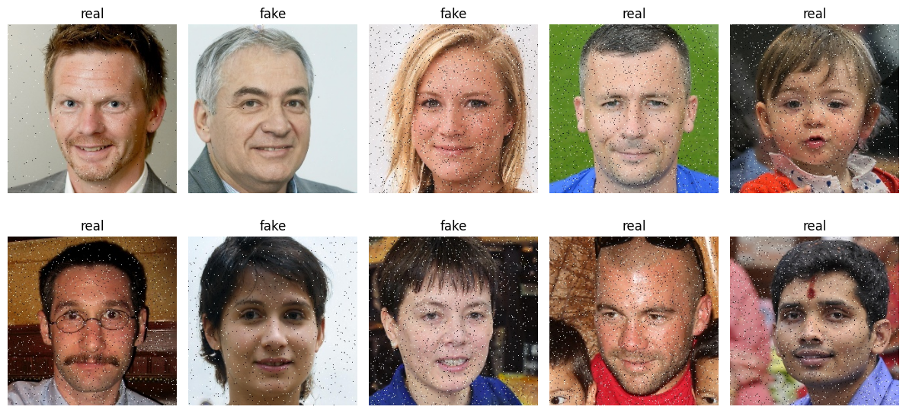
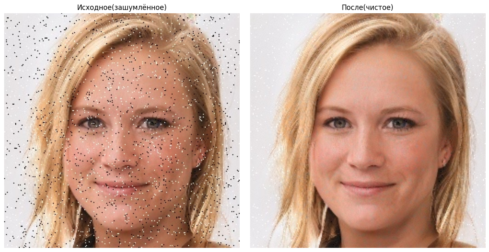
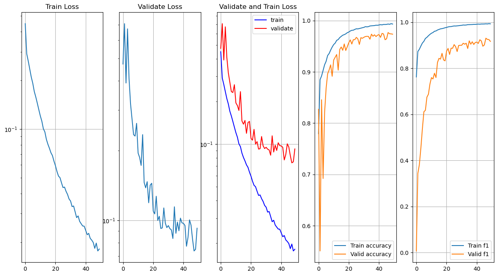
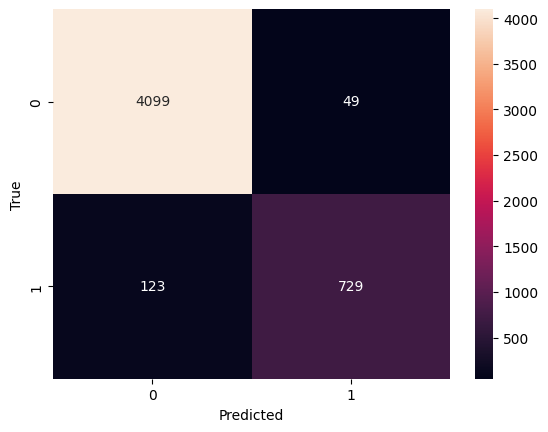
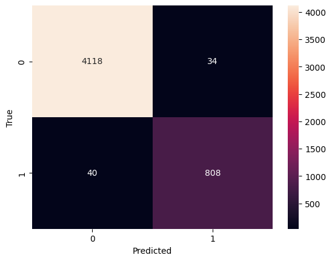

# Deepfake Detection

Классификация лиц на **real / fake** для соревнования
[Yandex ML Intensive 2025](https://www.kaggle.com/competitions/ml-intensive-yandex-academy-autumn-2025).

- **Задача:** бинарная классификация изображений 256×256
- **Данные:** 50 000 train / 10 000 test, дисбаланс ≈ 83% real / 17% fake, шум «соль и перец»
- **Лучшая модель:** InceptionV1 + GELU (val F1 ≈ 0.97)
- **Стек:** PyTorch, torchvision, scikit-learn, OpenCV, pandas, matplotlib

---

## Содержание

- [О проекте](#о-проекте)
- [Структура проекта](#структура-проекта)
- [Данные](#данные)
- [Установка](#установка)
- [Модели](#модели)
- [Как проверить работу](#как-проверить-работу)
- [Результаты](#результаты)
- [Автор](#автор)

---

## О проекте

Проект решает задачу детекции дипфейков на изображениях лиц.
Пайплайн состоит из четырёх шагов:

1. **EDA** — разведочный анализ (`notebooks/01_eda.ipynb`)
2. **Препроцессинг** — разбиение 80/20 и 90/10, балансировка классов,
   очистка шума эвристикой «соль и перец» (`notebooks/02_preprocessing.ipynb`)
3. **Обучение** — три архитектуры: InceptionV1, InceptionV3, ResNet50
   (`notebooks/04_training.ipynb`)
4. **Оценка** — метрики, confusion matrix, ROC (`notebooks/05_evaluation.ipynb`)

Дополнительно исследовались денойзеры (UNet + L1, UNet + Noise2Void,
ResNet + Noise2Void) — они не дали прироста на валидации относительно
эвристической очистки.

---

## Структура проекта

```
.
├── src/
│   ├── __init__.py
│   ├── config.py          # SEED, DEVICE, пути, гиперпараметры
│   ├── datasets.py        # датасеты и препроцессинг
│   ├── models.py          # все архитектуры
│   ├── train.py           # циклы обучения
│   └── utils.py           # метрики, графики, submission
├── notebooks/
│   ├── 01_eda.ipynb
│   ├── 02_preprocessing.ipynb
│   ├── 03_denoising_experiments.ipynb
│   ├── 04_training.ipynb
│   └── 05_evaluation.ipynb
├── data/
│   ├── raw/               # исходные данные (не в репо)
│   └── processed/         # разбиения 80/20 и 90/10
├── models/                # веса *.pth и *.history.json
├── reports/
│   └── figures/
│       └── old_notebook/  # исторические графики из read_data.ipynb
├── Makefile               # make verify — проверка в одну команду
├── requirements.txt
└── README.md
```

---

## Данные

Датасет нужно скачать отдельно:

**https://www.kaggle.com/competitions/ml-intensive-yandex-academy-autumn-2025**

Положить в `data/raw/`:

- `data/raw/train_solution.csv`
- `data/raw/train_images/*.jpg`
- `data/raw/test_images/*.jpg`

> ⚠️ **В репозитории лежат только по 10 изображений каждого класса
> для демонстрации пайплайна.** Для полноценного обучения скачайте
> полный датасет по ссылке выше.

---

## Установка

```bash
git clone https://github.com/theal1ve/GAN_DETECTION.git
cd GAN_DETECTION

python -m venv .venv
source .venv/bin/activate     # Windows: .venv\Scripts\activate

pip install -r requirements.txt
```

**Требования:**

- Python ≥ 3.9
- PyTorch ≥ 2.0
- GPU опционально (без него обучение трёх моделей займёт десятки часов)

`requirements.txt`:

```
torch>=2.0
torchvision>=0.15
numpy
pandas
scikit-learn
matplotlib
seaborn
opencv-python
Pillow
tqdm
jupyter
nbconvert
```

---

## Модели

| Модель           | Параметров | Комментарий                  |
| ---------------- | ---------- | ---------------------------- |
| **InceptionV1**  | ~6.9M      | лучшая, val F1 ≈ 0.97        |
| **InceptionV3**  | ~27M       | тяжёлая, дольше обучается    |
| **ResNet50**     | ~25M       | baseline                     |

Веса сохраняются в `models/*.pth`, история обучения — `models/*.history.json`.

---

## Как проверить работу

### Самое простое — одна команда

```bash
make verify
```

Эта команда сама:

1. установит зависимости,
2. подготовит данные (разобьёт на train/test),
3. обучит модель или загрузит готовые веса,
4. посчитает метрики и построит графики,
5. соберёт отчёт в `reports/verify_report.md`.

После завершения в консоли появится подсказка, какие файлы открыть.

**Если `make` не установлен** (на macOS достаточно один раз):

```bash
xcode-select --install
```

### Что посмотреть после

| Файл | Что внутри |
|---|---|
| `reports/verify_report.md` | Отчёт с метриками и графиками |
| `reports/figures/model_comparison.csv` | Сравнение моделей |
| `reports/figures/<model>_confusion_matrix.png` | Матрица ошибок |
| `reports/figures/<model>_roc_curve.png` | ROC-кривая |
| `reports/figures/<model>_history.png` | История обучения |

### Хочу посмотреть подробнее — открыть ноутбук

```bash
jupyter notebook notebooks/05_evaluation.ipynb
```

В первой ячейке выбери модель:

```python
MODEL_NAME = "inception_v1"   # "inception_v1" | "inception_v3" | "resnet50"
```

Затем запусти ноутбук целиком: **Kernel → Restart & Run All**.

### Ручной запуск (если не хочется `make`)

```bash
# 1. Препроцессинг — создаёт data/processed/clean_90_10/
jupyter nbconvert --to notebook --execute notebooks/02_preprocessing.ipynb --inplace

# 2. Оценка — метрики, графики, отчёт
jupyter nbconvert --to notebook --execute notebooks/05_evaluation.ipynb --inplace

# 3. (опционально) Полное обучение с нуля
jupyter nbconvert --to notebook --execute notebooks/04_training.ipynb --inplace
```

⚠️ Обучение трёх моделей с нуля требует GPU. Для быстрой проверки
уменьшите `NUM_EPOCHS` в `src/config.py`.

### Что делать, если весов нет

Ноутбук сам это поймёт и покажет **демо-прогон**: обучит модель прямо
во время выполнения на тех данных, которые есть. Метрики будут
случайными — это ожидаемо. В конце ноутбука появится явное
предупреждение.

Чтобы получить настоящие результаты:

1. Скачайте полный датасет (см. раздел «Данные»).
2. Запустите `notebooks/04_training.ipynb`.
3. Вернитесь в `notebooks/05_evaluation.ipynb` и запустите заново.

---

## Результаты

> **Примечание.** Графики ниже получены в исходном ноутбуке `read_data.ipynb`
> до рефакторинга. Воспроизводимый пайплайн — в `notebooks/04_training.ipynb`,
> веса сохранены в `models/*.pth`.

### Сводка метрик

| Модель                | Accuracy | Precision | Recall |   F1   | ROC-AUC |
| --------------------- | -------- | --------- | ------ | ------ | ------- |
| InceptionV1 + GELU    | 0.9908   | 0.9696    | 0.9764 | 0.9730 | 0.9851  |
| InceptionV3           | 0.9852   | 0.9596    | 0.9528 | 0.9562 | 0.9723  |
| ResNet50              | 0.9656   | 0.9370    | 0.8556 | 0.8944 | 0.9219  |

### Примеры данных



### Очистка шума



### Лучшая модель (InceptionV1 + GELU)




### Сравнение моделей

**ResNet50:**



**InceptionV3:**



---

## Автор

**Шаров Михаил** — Yandex ML Intensive 2025.