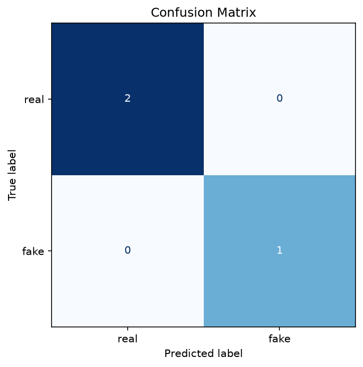
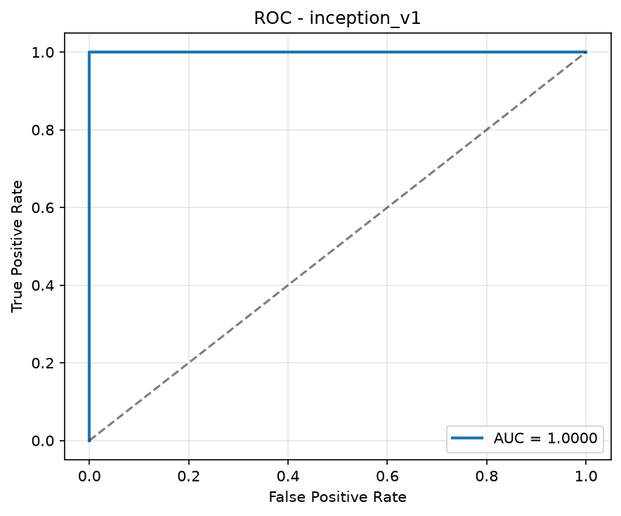

# Отчёт о проверке модели

**Дата:** 2026-09-21 01:16:31  
**Модель:** `inception_v1`  
**Устройство:** `cpu`  
**Режим:** оценка загруженных весов  

## Метрики

| Метрика | Значение |
|---|---|
| accuracy | 1.0000 |
| precision | 1.0000 |
| recall | 1.0000 |
| f1 | 1.0000 |
| roc_auc | 1.0000 |

## Графики

### Confusion Matrix



### ROC-кривая



---

## Как воспроизвести

```bash
make verify
```